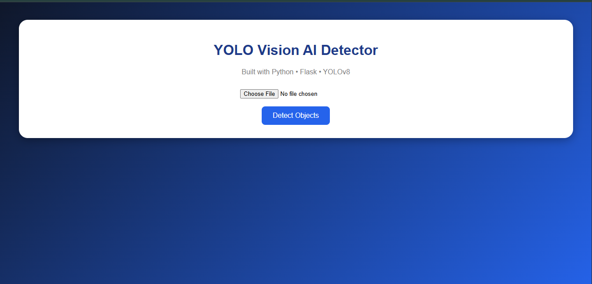

# VisionAI Detector

An AI-powered web application for image-based object detection built using **YOLOv8**, **Flask**, and **PyTorch**.

This project allows users to upload an image through a web interface, perform deep learning-based object detection, identify multiple objects, generate bounding boxes, and display object counts automatically.

---

## Preview

### Homepage

### Detection Result

---

## Project Overview

VisionAI Detector is a computer vision application that combines artificial intelligence with backend web development.

The system accepts an uploaded image from the user, passes it through a YOLOv8 object detection model, performs inference, identifies objects present in the image, and returns the processed output with bounding boxes and object count information.

The project demonstrates practical integration of machine learning inference pipelines with web applications.

---

## Features

* Image upload through browser
* AI-based object detection using YOLOv8
* Multi-object detection in a single image
* Automatic counting of detected objects
* Bounding box visualization
* Original image and processed image comparison
* Frontend interface built using HTML and CSS
* Flask backend for request handling

---

## System Architecture

User uploads image
↓
Flask backend receives image
↓
Image stored temporarily for processing
↓
YOLOv8 model performs inference
↓
Objects detected and classified
↓
Object classes extracted
↓
Object counts calculated
↓
Bounding boxes generated
↓
Processed result returned to frontend

---

## Tech Stack

* Python
* Flask
* YOLOv8 (Ultralytics)
* PyTorch
* HTML
* CSS
* Gunicorn
* Git
* GitHub

---

## Dependencies

The application uses the following libraries and frameworks:

* Flask → Backend web framework
* Ultralytics → YOLOv8 object detection framework
* PyTorch → Deep learning inference engine
* HTML/CSS → Frontend user interface
* Gunicorn → Production deployment server
* Git/GitHub → Version control and project management

---

## How It Works

1. User uploads image through frontend
2. Flask backend receives uploaded image
3. Image is stored temporarily for processing
4. YOLOv8 model runs inference on image
5. Objects inside image are detected and classified
6. Bounding boxes are generated automatically
7. Object counts are extracted from model output
8. Processed result is displayed on frontend

---

## Technical Learnings

During development, several engineering challenges were encountered and solved:

* Flask template rendering issues
* Static file serving configuration
* File upload handling in backend systems
* AI model integration with web applications
* Extracting model outputs and detected object classes
* Counting detected objects using Python collections
* Understanding deployment constraints for machine learning applications
* Managing Git version control and deployment workflows

---

## Engineering Challenges Solved

Real-world debugging and development challenges included:

* Handling image uploads correctly in Flask
* Managing static files for frontend rendering
* Backend and frontend integration issues
* Saving original and processed images correctly
* Working with YOLO model inference outputs
* Deployment failures caused by cloud memory limitations during PyTorch inference
* Production server configuration using Gunicorn

---

## Future Improvements

Potential future upgrades:

* Real-time webcam object detection
* Video-based object detection
* Confidence score display for detected objects
* Custom-trained YOLO models for specific use cases
* GPU-based cloud deployment for scalable inference
* Drag-and-drop image upload interface
* Live object detection pipeline

---

## Deployment Notes

The application runs successfully in a local development environment.

Deployment experiments were conducted on cloud hosting platforms. During testing, inference workloads exceeded free-tier memory limits because of the runtime requirements of PyTorch and YOLOv8.

This project provided practical understanding of infrastructure constraints, memory optimization, and real-world challenges involved in deploying machine learning systems.

---

## Repository Structure

VisionAI Detector/

├── app.py
├── Procfile
├── requirements.txt
├── README.md
├── website.png
├── result.png
├── yolov8n.pt
│
├── templates/
│   └── index.html
│
├── static/
│   ├── style.css
│   ├── original.jpg
│   └── result.jpg

---

## Project Status

Version 1 completed successfully.

Core object detection pipeline fully implemented and functional in local development environment.

---

## Project Goal

This project was built to explore practical applications of computer vision, deep learning inference, backend web development, and deployment workflows.

---

Built as a Computer Vision and AI Engineering portfolio project.

